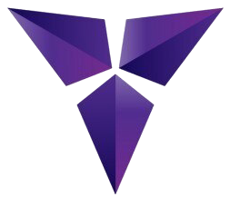
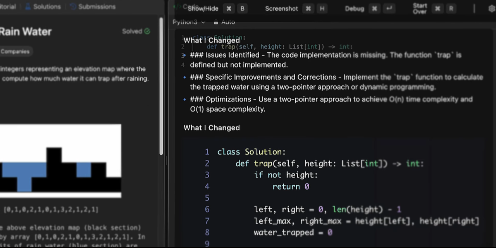

<h1 align="center" style>
  <br>
  <a href="" target="_blank"></a>
  <br>
  Shadow
  <br/>
</h1>

<h4 align="center">
	An AI powered coding assistant that reads problems from screenshots and delivers instant solutions - while remaining invisible to screen recorders.
</h4>

<p align="center">
  <p align="center">
  <a href="" target="_blank">
    
  </a>
  <a href="" target="_blank">
    
  </a>
  <a href="" target="_blank">
    
  </a>
  <a href="https://choosealicense.com/licenses/mit" target="_blank">
    
  </a>
  <a href="" target="_blank">
    
  </a>
  <a href="" target="_blank">
    
  </a>
  <a href="" target="_blank">
    
  </a>
  <a href="" target="_blank">
    
  </a>
</p>
</p>

<p align="center">
  <a href="#key-features">Key Features</a> •
  <a href="#how-to-use">How To Use</a> •
  <a href="#how-to-contribute">How To Contribute</a> •
  <a href="#technologies">Technologies</a> •
  <a href="#license">License</a>
</p>

<p align="center">
  
</p>

<!-- 🌐 **Live Demo**🔗 [crusto-pizza.vercel.app](https://crusto-pizza.vercel.app) -->

## Key Features

- **Screenshot Capture** - Global hotkeys for instant problem screenshot capture
- **AI Problem Analysis** - Extract coding problems from images using GPT/Gemini
- **Multi-Language Support** - Generate solutions in Python, C++, Java, and more
- **Solution Generation** - Optimized code with detailed explanations and complexity analysis
- **Debug Mode** - Analyze error screenshots for solution improvements
- **Dual AI Providers** - Switch between OpenAI GPT and Google Gemini models
- **Always-On-Top Window** - Overlay interface that stays accessible during coding
- **Click-Through Mode** - Toggle window interaction for seamless workflow
- **Global Shortcuts** - Complete keyboard control without leaving your IDE
- **Screenshot Management** - Queue system for multiple problem images
- **Automatic Cleanup** - Smart file management and temporary data handling
- **Configuration Persistence** - Save API keys, preferences, and window settings
- **Cross-Platform** - Works on Windows, macOS, and Linux
- **Opacity Control** - Adjust window transparency for optimal visibility

## Project Structure

```
shadow-stealth-ai-assistant/
├── src/
│   ├── main/                    # Electron main process
│   │   ├── index.ts            # Application entry point and window management
│   │   └── lib/                # Core business logic
│   │       ├── config-manager.ts        # User settings and API key management
│   │       ├── processing-manager.ts    # AI processing orchestration
│   │       ├── screenshot-manager.ts    # Screenshot capture and file management
│   │       ├── keyboard-shortcut.ts     # Global shortcuts and window controls
│   │       └── ipc-handler.ts          # Inter-process communication handlers
│   ├── preload/                # Secure IPC bridge
│   │   ├── index.ts            # Preload script for renderer communication
│   │   └── index.d.ts          # TypeScript definitions for exposed APIs
│   └── renderer/               # React frontend
│       ├── index.html          # HTML entry point
│       └── src/
│           ├── App.tsx         # Root React component
│           ├── main.tsx        # React DOM render entry
│           ├── components/     # UI components
│           │   ├── main-app.tsx         # Primary application interface
│           │   ├── screenshots-view.tsx # Screenshot management UI
│           │   ├── settings-dialog.tsx  # Configuration interface
│           │   ├── solutions.tsx        # AI solution display
│           │   └── welcome-screen.tsx   # Initial setup screen
│           ├── providers/      # React context providers
│           │   ├── query-provider.tsx   # TanStack Query setup
│           │   ├── toast-context.tsx    # Toast notification context
│           │   └── toast-provider.tsx   # Toast provider implementation
│           ├── lib/           # Shared utilities and types
│           │   ├── types.ts   # TypeScript type definitions
│           │   ├── utils.ts   # Utility functions
│           │   └── languages.ts # Programming language configurations
└---------- └── assets/        # Static assets (CSS, images)
```

## How To Use

To clone and run this application, you'll need [Git](https://git-scm.com) and [Node.js](https://nodejs.org/en/download) (which comes with [npm](http://npmjs.com)) installed on your computer. From your command line:

##### Clone this repository

```bash
$ git clone https://github.com/kunaldasx/shadow-stealth-ai-assistant
$ cd shadow-stealth-ai-assistant
```

#### Development Commands

```bash
# Install dependencies
npm install

# Development mode with hot reload
npm run dev

# Build the application
npm run build
```

#### Platform-Specific Builds

```bash
# Windows build
npm run build:win

# macOS build
npm run build:mac

# Linux build
npm run build:linux

# Build without packaging (for testing)
npm run build:unpack
```

## How to Contribute

1. Clone repo and create a new branch: `$ https://github.com/kunaldasx/shadow-stealth-ai-assistant -b name_for_new_branch`.
2. Make changes and test
3. Submit Pull Request with comprehensive description of changes

## Emailware

Crusto is an [emailware](https://en.wiktionary.org/wiki/emailware). Meaning, if you liked using this app or it has helped you in any way, I'd like you send me an email at <kunaldasx@gmail.com> about anything you'd want to say about this software. I'd really appreciate it!

## Technologies

This software uses the following technologies:

- **Electron 35.0.0**: Cross-platform desktop application framework
- **Node.js**: Server-side JavaScript runtime for main process
- **Electron Vite 3.1.0**: Modern build tooling with HMR support
- **React 19.1.0**: UI library with modern hooks and concurrent features
- **TypeScript 5.8.3**: Static typing for JavaScript
- **TailwindCSS 4.1.4**: Utility-first CSS framework
- **Radix UI**: Accessible component primitives for dialogs and toasts
- **TanStack Query 5.74.4**: Server state management and caching
- **Framer Motion 12.23.12**: Animation library
- **React Syntax Highlighter**: Code syntax highlighting

## Support

If you like this project and think it has helped in any way, consider buying me a coffee!

<a href="" target="_blank"></a>

## License

MIT

---

> 🌐 [Visit my website →](https://kunaldasx.vercel.app/)<br>
> 🖥️ [GitHub](https://github.com/kunaldasx) &nbsp;&middot;&nbsp;
> 💼 [LinkedIn](https://www.linkedin.com/in/kunaldasx/) &nbsp;&middot;&nbsp;
> 🐦 [Twitter / X](https://x.com/Kunaldasx) &nbsp;&middot;&nbsp;
